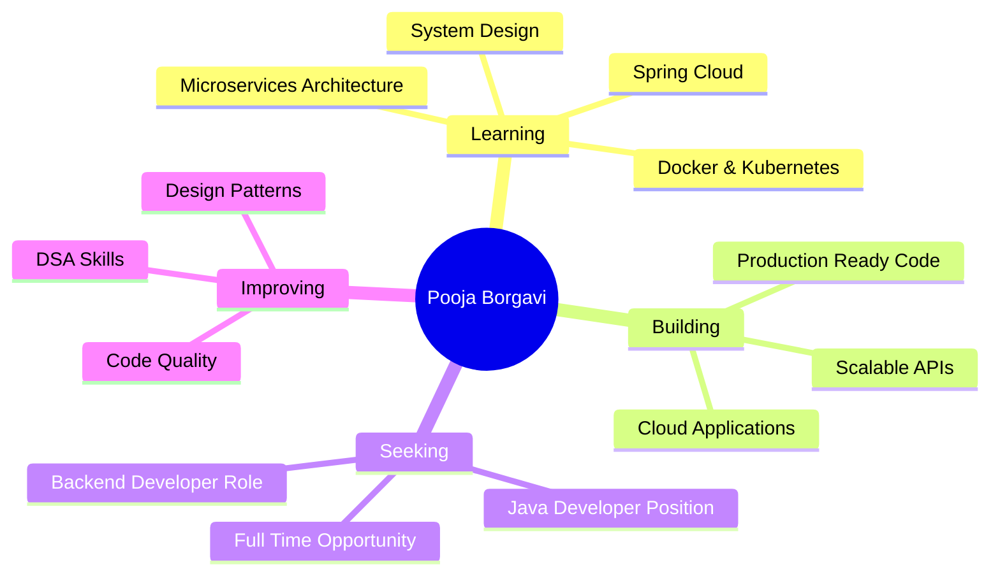

<h1 align="center">
  
</h1>

<p align="center">
  
  
  
    
  
</p>

<div align="center">
  
  [](https://linkedin.com/in/pooja-borgavi)
  [](mailto:borgavipooja@gmail.com)
  [](https://github.com/Poojaborgavi8080)
  [](https://github.com/Poojaborgavi8080)
  
</div>


##  About Me

```typescript
const pooja = {
    role: "Java Developer & Data Analyst",
    code: ["Java", "Python", "C++",  "SQL"],
    technologies: {
        backend: {
            java: ["Spring Boot", "Spring MVC", "Hibernate", "JPA"],
            python: ["Flask"],
            databases: ["MySQL", "PostgreSQL", "MongoDB"]
        },
        frontend: ["Angular",  "HTML5", "CSS3"],
        tools: ["Git", "Maven", "Postman", "IntelliJ IDEA", "VS Code"],
        architecture: ["Microservices", "Monolithic", "REST API", "MVC"]
    },
dataAnalytics: {
        tools: ["Python", "Excel", "Power BI"],
        libraries: ["Pandas", "NumPy", "Matplotlib", "Seaborn"],
        skills: [
            "Data Cleaning",
            "Data Visualization",
            "Exploratory Data Analysis (EDA)",
            "Statistical Analysis",
            "Dashboard Creation"
        ]
    },
    experience: {
        company: "HefShine Softwares",
        role: "Java Full Stack Developer Intern",
        duration: "6+ months",
        projects: "2+ Production Applications",
        impact: "40% efficiency improvement"
    },
    currentFocus: "Building scalable backend solutions",
    availableFor: "Backend Developer / Java Developer roles",
    location: "Pune, Maharashtra 🇮🇳"
};
```


## 🎯 Professional Highlights

<table>
  <tr>
    <td align="center" width="25%">
      <br/>
      <b>Education</b><br/>
      MCA from SPPU<br/>
      <sub>2024-2026</sub>
    </td>
    <td align="center" width="25%">
      <br/>
      <b>Experience</b><br/>
      6+ Months Internship<br/>
      <sub>HefShine Softwares</sub>
    </td>
    <!-- <td align="center" width="25%">
      <br/>
      <b>Projects</b><br/>
      2+ Production Apps<br/>
      <sub>Serving Real Users</sub>
    </td> -->
    <td align="center" width="25%">
      <br/>
      <b>Impact</b><br/>
      40% Efficiency Gain<br/>
      <sub>Through API Automation</sub>
    </td>
  </tr>
</table>


 🛠️ Tech Stack & Skills

<div align="center">

 💻 Programming Languages
<p>
  
  
  
  
</p>

🚀 Backend Frameworks & Tools
<p>
  
  
  
  
  
  
</p>
 📊 Data Analytics Technologies
<p>
  
  
  
  
  
  
  
</p>
### 🗄️ Databases
<p>
  
  
  
  
</p>

### 🎨 Frontend Technologies
<p>
  
  
  
  
</p>

### 🔧 Tools & Platforms
<p>
  
  
  
  
  
</p>

### 🏗️ Architecture & Concepts
<p>
  
  
  
  
  
  
</p>

</div>


## 🏆 Featured Projects

<div align="center">

### 🎯 [RealEye - Study Module Backend](https://github.com/Poojaborgavi8080/RealEye-Backend)


```
✨ Architected 5+ RESTful APIs for study content & quiz management
⚡ Real-time answer validation with instant feedback system
📊 Built analytics dashboard tracking daily/weekly/monthly metrics
🎯 Optimized database queries handling 10,000+ quiz submissions
🔥 Tech: JPA relationships, DTO pattern, pagination, exception handling
```

---

### 🎨 [Art Gallery Management System](https://github.com/Poojaborgavi8080/Art-Gallery-Management)


```
🎨 Full-stack application with role-based access control (RBAC)
⚡ Automated artwork classification reducing manual effort by 50%
🔍 Advanced search & filter with category management
📱 Responsive Angular frontend with seamless API integration
🔥 Tech: Spring Security, CRUD operations, TypeScript interfaces
```

---

### 💼 [Job Portal System](https://github.com/Poojaborgavi8080/Job-Portal)


```
💼 Dual-role system for job seekers & employers
📋 Complete application tracking from posting to hiring
📄 Resume upload with secure file handling & storage
🤖 Smart job-applicant matching algorithm
🔥 Tech: Multi-role authentication, file upload, complex SQL queries
```

---

### 🔥 [Flask CRUD with Firebase](https://github.com/Poojaborgavi8080/Creating-a-CRUD-App-using-Flask-Firebase)


```
🔥 Real-time database synchronization with Firebase
📊 Complete CRUD operations with NoSQL architecture
🌐 RESTful API design following industry best practices
☁️ Cloud database integration demonstrating modern backend skills
```

</div>


## 📊 GitHub Statistics

<div align="center">
  
  
</div>

<div align="center">
  
  
</div>

<div align="center">
  
</div>


## 💡 What Makes Me Stand Out

<table>
<tr>
<td width="50%">

### 🎯 Backend Expertise
```java
public class Developer {
    private String[] strengths = {
        "Building scalable REST APIs",
        "Database optimization & design",
        "Clean, maintainable code",
        "Quick learner with strong fundamentals",
        "Team collaboration & Agile practices"
    };
    
    public void deliverValue() {
        while (true) {
            learn();
            code();
            improve();
            deliver();
        }
    }
}
```

</td>
<td width="50%">

### ✨ Key Achievements

- 🚀 **40% Efficiency** improvement
- 📊 **5+ REST APIs** designed
- 💻 **6+ Months** hands-on experience
- 🎓 **Corporate Training** completed
- ⚡ **Agile/Scrum** practiced
- 🔥 **Clean Code** advocate

</td>
</tr>
</table>


## 📈 Professional Experience

<div align="center">

###  Java Full Stack Developer Intern
**HefShine Softwares** | Pune, Maharashtra | *Aug 2023 – Jan 2024*

</div>

<table>
  <tr>
    <td>✅ Designed <b>5+ RESTful APIs</b> reducing processing time by <b>40%</b></td>
  </tr>
  <tr>
    <td>✅ Leveraged <b>JPA/Hibernate</b> for optimized database operations</td>
    <td>✅ Worked in <b>Agile sprints</b> with code reviews & Git workflows</td>
  </tr>
  <tr>
    <td>✅ Completed training in <b>DSA, Design Patterns, Advanced Java</b></td>
    <td>✅ Reduced manual data processing by <b>40%</b> through automation</td>
  </tr>
</table>


## 🎓 Education

<div align="center">

| Degree | Institution | Duration | Status |
|--------|------------|----------|--------|
| 🎓 **Master of Computer Applications (MCA)** | Savitribai Phule Pune University | 2024 - 2026 | 🔄 In Progress |
| 🎓 **Bachelor of Computer Science** | Shivaji University, Kolhapur | 2020 - 2023 | ✅ Completed |

</div>


## 🎯 Current Focus & Goals

<div align="center">



</div>


## 🤝 Let's Connect & Collaborate!

<div align="center">

### 💼 I'm Currently Seeking Opportunities As:


### ✨ Why Hire Me?

<table>
  <tr>
    <td align="center">
      <br/>
      <b>Clean Code</b><br/>
      <sub>Production-ready quality</sub>
    </td>
    <td align="center">
      <br/>
      <b>Real Experience</b><br/>
      <sub>6+ months internship</sub>
    </td>
    <td align="center">
      <br/>
      <b>Quick Learner</b><br/>
      <sub>Passionate about tech</sub>
    </td>
    <td align="center">
      <br/>
      <b>Delivers Results</b><br/>
      <sub>40% efficiency gain</sub>
    </td>
  </tr>
</table>

### 📫 Reach Out to Me

<p>
  <a href="https://linkedin.com/in/pooja-borgavi">
    
  </a>
  <a href="mailto:borgavipooja@gmail.com">
    
  </a>
  <a href="https://github.com/Poojaborgavi8080">
    
  </a>
  <a href="tel:+917972478080">
    
  </a>
</p>

### 📱 Contact Details
📧 **Email:** borgavipooja@gmail.com  
📞 **Phone:** +91-7972478080  
📍 **Location:** Pune, Maharashtra, India  
🔗 **LinkedIn:** [linkedin.com/in/pooja-borgavi](https://linkedin.com/in/pooja-borgavi)

</div>


## 🎯 Quick Facts

<div align="center">

| 💻 Code | 🎓 Learn | 🚀 Build | 🌟 Deliver |
|---------|----------|----------|------------|
| Daily coding practice | Continuous learning | Real-world projects | Production-ready solutions |
| Clean & maintainable | New technologies | Scalable architecture | Business value |
| Best practices | Design patterns | Modern frameworks | Measurable impact |

</div>


<div align="center">

## 🌟 "Code is poetry. Make it beautiful, make it meaningful, make it count." 🌟

### ⭐ If you find my projects useful, consider giving them a star! ⭐


</div>

---

<div align="center">

### 💖 Thanks for visiting my profile! Let's build something amazing together! 💖


</div>
